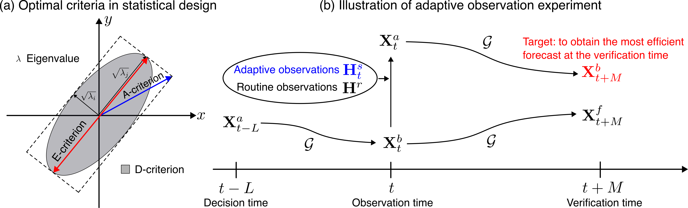

Optimal experimental design on adaptive observation experiments

## Motivation

This repository shows the story of the adaptive observation experiments by 40-variable Lorenz-96 model: 
$$\frac{dx_i}{dt}=(x_{i+1}-x_{i-2})x_{i-1} - x_i + F,$$ 
where $F$ is the forcing and the variable $x_i$ is taken to be periodic: $x_{i+n} = x_{i}$.
In this study, we set $n=40$ and $F=8$.  The
nodes numbered from 1 to 20 lie over the ocean, and those from 21 to 40 lie over
the land (Fig. 1).

<em>Figure 1. An illustration on the 40-variable Lorenz-96 model </em>

All land sites receive observations very 6 hours; while there are no routine observations all over the ocean. 

**The objective of this study is to find one supplementary oceanic site which receives observation every 6 hour to provide the best forecast skills over the globe.** 

## Background

To reproduce the experiments by Lorenz and Emanuel (1998), I set the experiments totally based on the paper. 

The time step is 0.05 unit, equals to 6 h.
One experiment lasts for 360 + 7200 + 40 time steps. 
L = 360 (i.e., 90 days) represents the transient behaviour. 
N = 7200 (i.e., 5 years) uses as the reference data (nature run or true state). 
M = 40 (i.e., 10 days) is the forecast range which will be verified. 

The initial value: $X_{i, -L} \in \mathbb{N}(F/4, F/2)$

Observation: $Y_{jn} = X_{jn} + a_{jn}, a_{jn} \in \mathbb{N}(0, \varepsilon),\ \varepsilon=F/40$

Data assimilation scheme: $R=0$, replace the forecast by the observation

Model error: $F^{'}=0.95F$

True value: $X_{jn}$ (At the end of $n$th time step)

Observed value: $Y_{jn}$ (At land and targeted ocean sites)

Analysis value: $Z_{jn}$ (At all sites)

Forecast value: $Z_{jnm}$ ($X_j$ forecast from the analysis $m$ times steps before the end of $n$th time step)

**A 0-day forecast is an analysis**

Forecast transient period: $Z_{j,-L,1} = X_{j,-L} + a_{j, -L}$

### Reproduction of the previous experiments

#### (1) Test the integration scheme for the Lorenz-96 model the same as Lorenz and Emanuel (1998)

<em>Figure 2. To reproduce the state variables of Lorenz-96 model for 2 days </em>

#### (2) Control case without supplementary observations

<em>Figure 3. Control case without supplementary observations </em>

#### (3) To select the targeted oceanic sites at random

<em>Figure 4. Random selection </em>

#### (4) To select the targeted oceanic sites where the analyszed and true values differ most greatly  

<em>Figure 5. Greatest difference between analysis and true state </em>

#### (5) To select the targeted oceanic sites by the multiple breeding method  

<em>Figure 6. Multiple breeding method </em>

<em>Figure 7. Resutls of multiple breeding method </em>

#### (6) To select the targeted oceanic sites by the multiple replicate method  

<em>Figure 8. Multiple replicate method </em>

<em>Figure 9. Resutls of multiple replicate method </em>

## Experimental settings

The study implement the optimal experimental design to the adpative observation epxeriments. 

<em>Figure 10. Illustration of optimal experimental design and adpative observation experiment</em>

## Results and discussions

### (1) Influence of optimality criteria on the observation selections 

<em>Figure 11. Influence of optimality criteria on the observation selections </em>

### (2) Influence of selection strategies on the observation selections 

<em>Figure 12. Influence of selection strategies on the observation selections </em>

### (3) Influence of multiple observations

<em>Figure 12. Influence of multiple observations on the results </em>

## Summary

The forecast could be improved if we select appropriate optimality criteria and error covariance. 

I welcome any discussion and comments on the adaptive observation studies, please contact me by mao.ouyang@durham.ac.uk (einooumo@hotmail.com). 
